# SRIFOODS  [](#)
<hr>

---
# Overview :scroll:
---
* SriFoods  :rice: :custard: is a Sample Android Food application using which users can access Foods Restaurant and its dishes Online by Browsing through variety of Foods Available.
* To access Food restaurant online users have to register themselves with SriFoods and login using their credentials
* Choose the restaurant they like and place order of their favourite dishes.
* Different Layouts of App Designed using XML 
* Flowchart for working of SriFoods is shown below
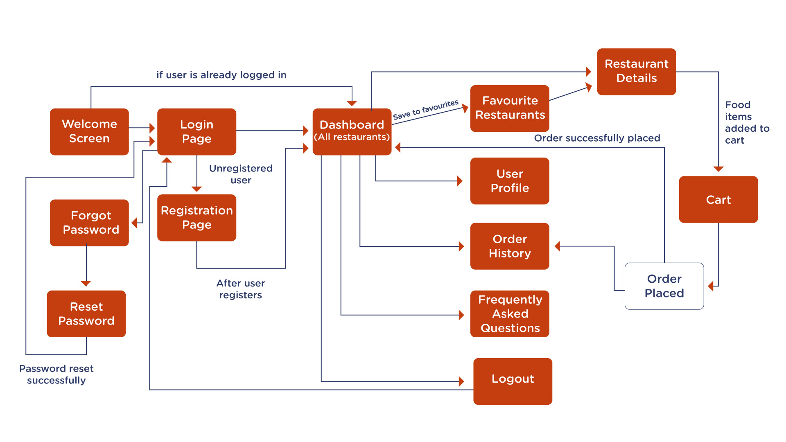

---
## How to user
From your command line:

```bash
# Fork the Repository

# Clone this repository to Remote Environment using Git Bash
$ git clone https://github.com/TechieMeSB/MyApp-SriFoods.git

```
### Open Android Studio and Navigate to location of MyApp-sSriFoods in Remote Environment then run the application.
---
# Screenshot of Application
<div>
  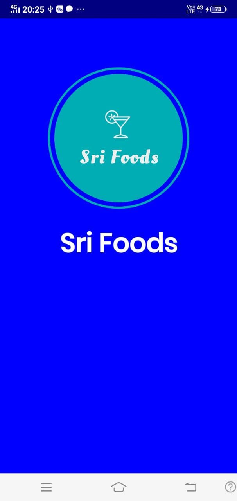
  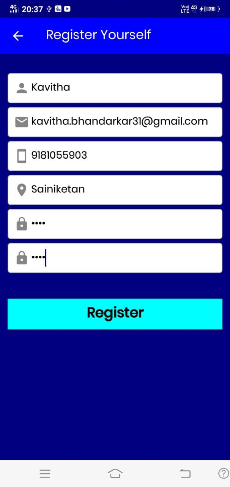
  
  
</div>
<br>
<div >
  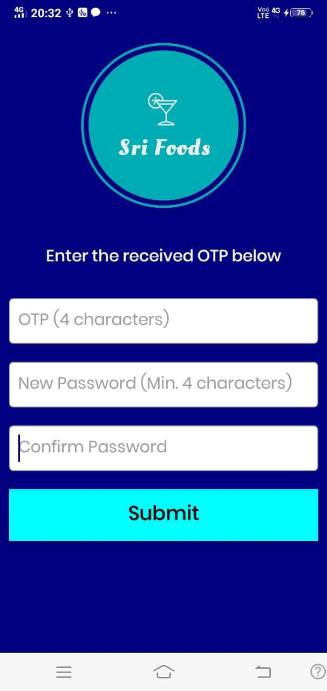
  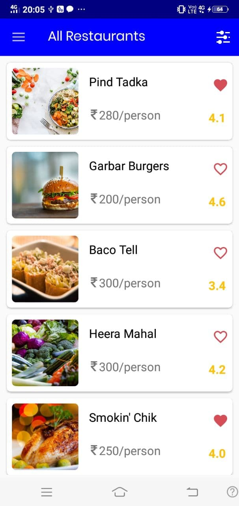
  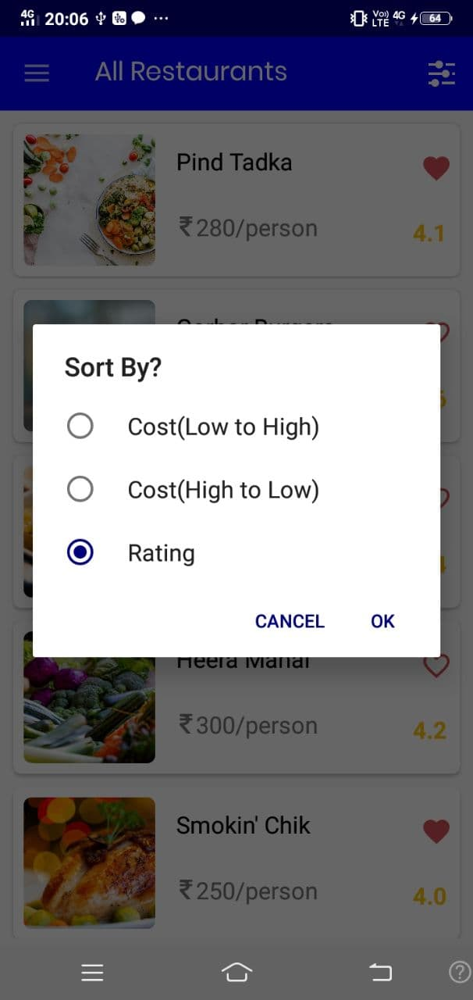
  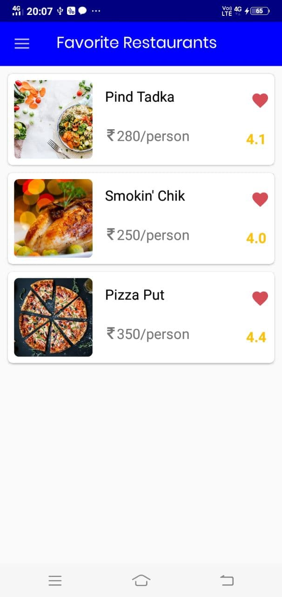
</div>
<br>
<div >
  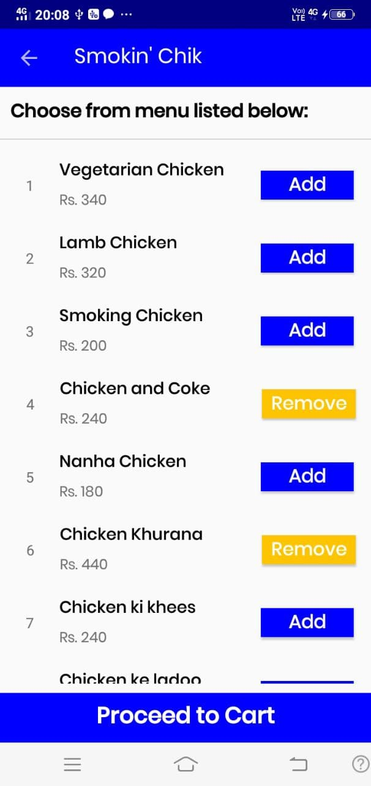
  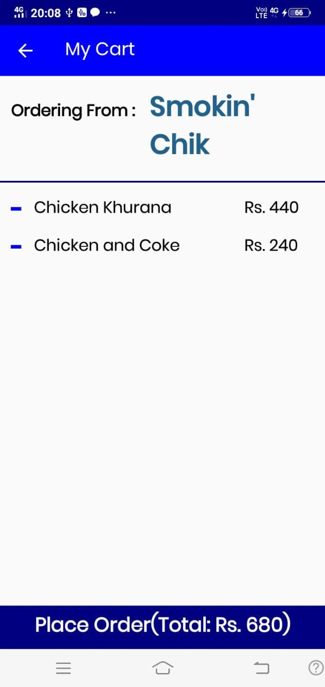
  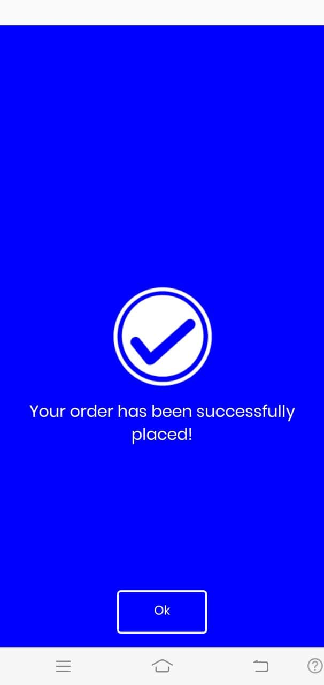
  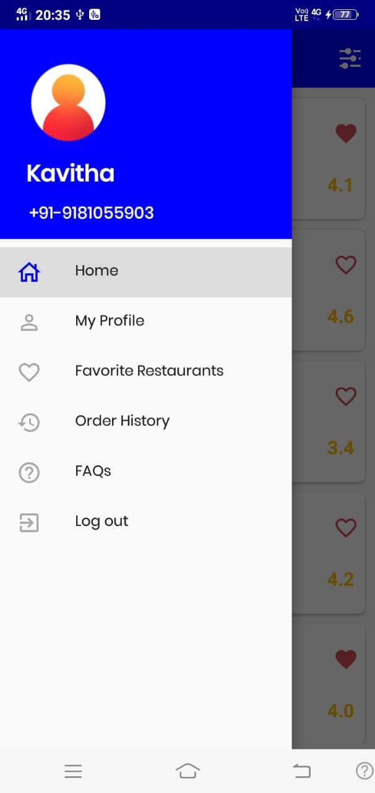
</div>
<br>
<div >
  
  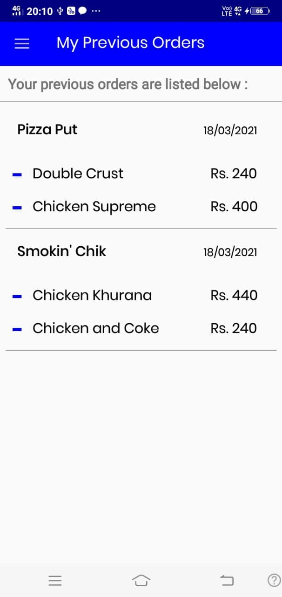
  
  
</div>


---
# Tools and Language 
[](#)
<br>
[](#)
<br>
[](#)
